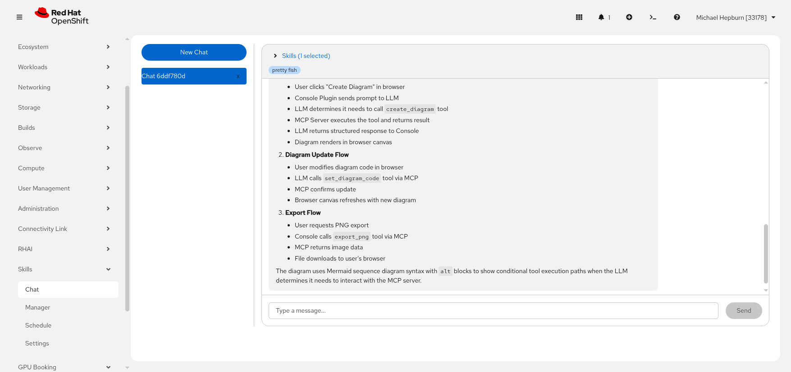
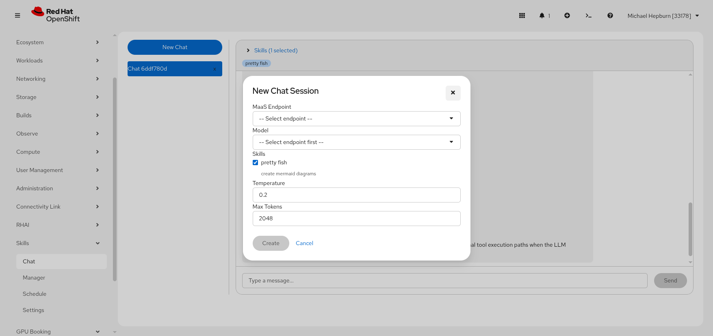

# Chat

Topics: Sessions, Messages, Skills, Models

---

## Overview

The Chat page provides an interactive interface for conversing with an LLM-driven agent. The agent has access to a `shell` tool and can execute `oc`, `kubectl`, and other commands directly on your OpenShift cluster.

---

## Creating a New Chat Session

Click the **New Chat** button in the sidebar to open the session creation modal.

| Field | Description |
|-------|-------------|
| **MaaS Endpoint** | Select the model serving endpoint to use |
| **Model** | Choose a specific model from the endpoint |
| **Skills** | Check which skills to include in this session |
| **Temperature** | Controls randomness (default: 0.2, lower = more deterministic) |
| **Max Tokens** | Maximum response length (default: 2048) |

Each session stores its own temperature and max tokens settings. These are passed to the LLM on every message in the session.

---

## Sending Messages

Type your message in the input bar at the bottom and click **Send** (or press Enter). The agent will:

1. Receive your message along with the full conversation history
2. Optionally call the `shell` tool to execute commands
3. Iterate up to 15 times (calling tools and processing results)
4. Return a final response

Responses are rendered as markdown with support for:
- Code blocks with syntax highlighting
- Tables
- Lists and blockquotes
- Inline code

---

## Per-Session Skills

Each chat session can have specific skills selected. The expandable **Skills** bar above messages shows which skills are active.

- Skills are pre-selected when creating a new session (all enabled skills checked by default)
- You can change skills on an active session by expanding the skills bar and toggling checkboxes
- If no skills are explicitly selected, the agent falls back to using all enabled skills

---

## Session Management

- **Switch sessions** by clicking a session name in the sidebar
- **Delete a session** by clicking the **x** button next to it
- The active session is highlighted in the sidebar
- Sessions are scoped to your user -- you only see your own sessions (admins can see all)

---

## Next Steps

- [Skills Manager](skills-manager) -- create skills to guide the agent
- [Schedule](schedule) -- automate skill execution
