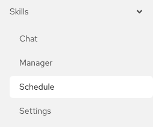

# Getting Started

Topics: Overview, Navigation, Prerequisites

---

## Introduction

The OpenShift Skills Plugin lets you run LLM-driven agent skills directly from the OpenShift Console. You can chat interactively with an AI assistant that has shell access to your cluster, upload knowledge files (skills) that guide the agent's behavior, and schedule skills to run automatically on a cron schedule or as one-off tasks.

### What you can do

- **Chat** with an AI agent that can execute `oc` and `kubectl` commands on your cluster
- **Upload skills** (SKILLS.md knowledge files) to guide the agent's behavior
- **Schedule tasks** to run skills automatically on a cron schedule or as run-once jobs
- **Configure MaaS endpoints** to connect to your LLM model serving infrastructure
- **Multi-turn conversations** with full context maintained across messages
- **Per-session skill selection** to focus the agent on specific tasks

---

## Navigation

The plugin adds a **Skills** section to the OpenShift Console admin navigation with four pages:

| Page | Purpose |
|------|---------|
| **Chat** | Interactive chat with the AI agent |
| **Manager** | Upload and manage skills (knowledge files) |
| **Schedule** | Schedule skills as recurring or one-off tasks |
| **Settings** | Configure MaaS endpoints, system prompt, and database |

---

## Prerequisites

Before using the plugin, you need:

1. **A MaaS endpoint** -- at least one Model-as-a-Service endpoint must be configured in Settings. This can be auto-seeded from a Kubernetes secret or added manually.
2. **RBAC access** -- your OpenShift user must have the appropriate ClusterRole bound:
   - `skills-plugin-user` for basic access
   - `skills-plugin-admin` for admin features (system prompt editing, database export/import, managing global resources)

Admin access is detected automatically via a SubjectAccessReview against the virtual resource <code>skills.openshift.io/plugins</code> with verb <code>admin</code>.

---

## Next Steps

- [Chat](chat) -- start chatting with the AI agent
- [Skills Manager](skills-manager) -- upload your first skill
- [Settings](settings) -- configure your MaaS endpoint
