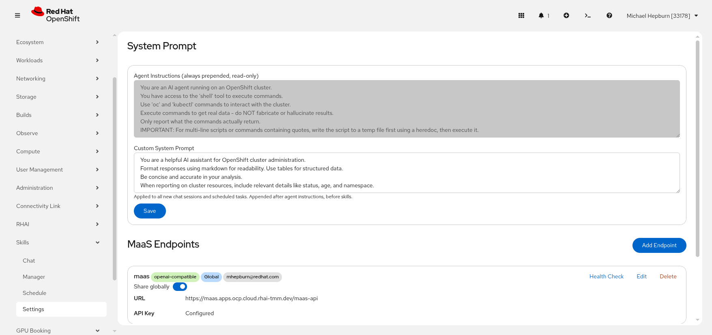

# Settings

Topics: Endpoints, System Prompt, Database

---

## Overview

The Settings page lets you configure MaaS (Model-as-a-Service) endpoints, customize the system prompt, and manage database export/import.

---

## System Prompt

The system prompt sent to the LLM is built in three layers:

1. **Agent Instructions** (read-only) -- always prepended. These instruct the agent on tool usage, data accuracy, and script handling. Shown as a disabled text area so you can see them.
2. **Custom System Prompt** (editable by admins) -- your custom instructions appended after the agent instructions. Applied to all new chat sessions and all scheduled task executions.
3. **Skills content** -- appended last, per-session or per-task.

Only admins can edit the custom system prompt. Non-admin users see it as read-only.

Click **Save** to persist changes to the custom system prompt.

---

## MaaS Endpoints

MaaS endpoints connect the plugin to your LLM model serving infrastructure. The plugin supports two endpoint types:

### Model Registry

A registry endpoint (e.g. `https://maas.example.com/maas-api`) exposes multiple models via `GET /v1/models`. Each model has its own inference URL.

### Single-Model URL

A direct model URL (e.g. `https://maas.example.com/prelude-maas/llama-32-3b/v1`) serves a single model. These are auto-detected by their URL pattern (path segments before `/v1`).

### Adding an Endpoint

Click **Add Endpoint** and fill in:

| Field | Description |
|-------|-------------|
| **Name** | A descriptive name for the endpoint |
| **URL** | The endpoint URL |
| **API Key** | Authentication key (stored securely, never returned to the frontend) |
| **Provider** | Provider type (e.g. `openai-compatible`) |

### Endpoint Cards

Each endpoint card shows:
- **Name** with provider type, visibility (Global/Private), and owner labels
- **Share globally** toggle
- **URL** and API key status (Configured/Not set)
- **Health Check**, **Edit**, and **Delete** buttons

API keys are never returned to the frontend. The UI shows "Configured" or "Not set" instead of the actual key.

### Auto-Seeding from Secret

On startup, the plugin checks for a `maas-secret` Kubernetes secret. If found and no endpoints exist yet, it automatically creates a default global endpoint. The plugin also watches for token rotation and updates the API key accordingly.

---

## Database Export/Import

Database export and import are admin-only features.

- **Export Database** -- downloads the SQLite database file for backup or migration
- **Import Database** -- uploads a database file to replace the current one. This reinitializes the database and reloads all scheduled tasks.

---

## Next Steps

- [Getting Started](getting-started) -- overview and prerequisites
- [Chat](chat) -- start using the configured endpoints
