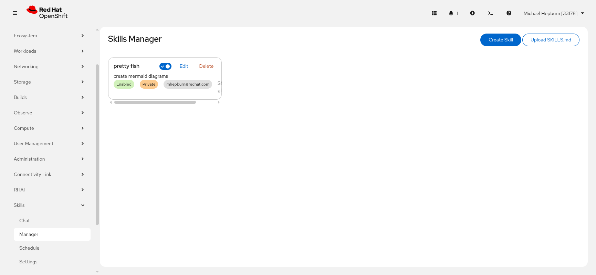

# Skills Manager

Topics: Skills, Upload, Global, Private

---

## Overview

The Skills Manager lets you create and manage knowledge files (SKILLS.md) that guide the AI agent's behavior. Skills are appended to the system prompt and give the agent domain-specific instructions, context, and procedures.

---

## Creating a Skill

There are two ways to add a skill:

### Create Skill (Manual)

Click **Create Skill** to open the creation form. Fill in:

| Field | Description |
|-------|-------------|
| **Name** | A short, descriptive name for the skill |
| **Description** | Brief summary of what the skill does |
| **Content** | The full skill content in markdown format |

### Upload SKILLS.md

Click **Upload SKILLS.md** to upload a markdown file. The file name becomes the skill name, and the file contents become the skill content.

---

## Skill Cards

Each skill is displayed as a card showing:

- **Name** and **description**
- **Enabled/Disabled** toggle -- disabled skills are not included in prompts
- **Labels** showing visibility (Global/Private), owner, and status
- **Edit** and **Delete** buttons (only visible if you own the skill or are an admin)
- **Share globally** toggle (only visible to skill owner or admin)

---

## Global vs Private Skills

| Type | Visibility | Who can edit |
|------|-----------|-------------|
| **Private** | Only you can see and use it | Only you |
| **Global** | All users can see and use it | Only the owner or admins |

Use the **Share globally** toggle on a skill card to make a private skill available to all users.

Sharing a skill globally means all users will see it in their skill selection lists and it will be included in their chat sessions if enabled.

---

## Writing Effective Skills

Skills are markdown documents that get appended to the system prompt. Good skills:

- Start with a clear description of the task or domain
- Include specific commands or procedures the agent should follow
- Provide context about expected inputs and outputs
- Use structured formatting (headers, lists, code blocks) for clarity

---

## Next Steps

- [Chat](chat) -- use skills in a chat session
- [Schedule](schedule) -- run skills on a schedule
